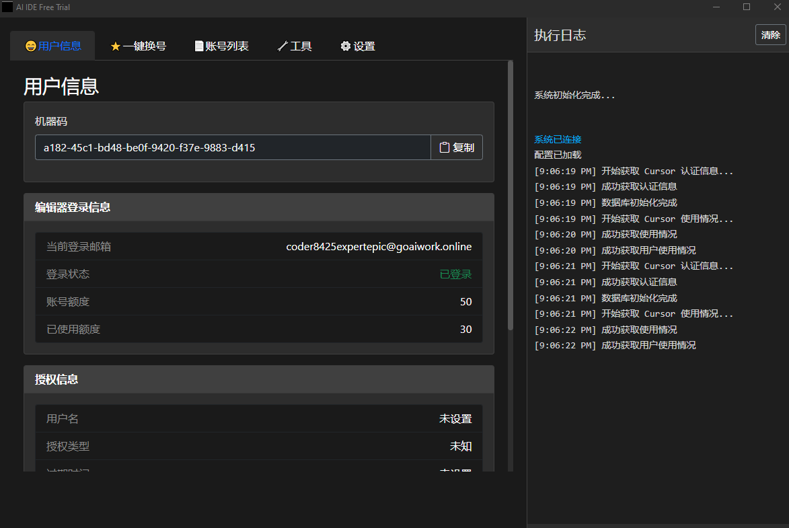

# 🚀 Cursor IDE Free Trial

[中文版](README_CN.md)



🎯 Cursor IDE Free Trial is a utility tool designed to help users conveniently experience the trial version of Cursor IDE. This tool primarily addresses machine code verification issues during the trial process and provides streamlined email and account management features.

## ✨ Project Introduction

This project is an Electron-based auxiliary tool focused on optimizing the trial experience of Cursor IDE. Main features include:
- 🔑 Resolve machine code verification issues
- 📧 Provide convenient email management functionality
- 👤 Simplify account management process
- ⚡ Optimize trial experience

⚠️ **Important Note:** If you find Cursor IDE meets your needs during the trial period, we strongly recommend purchasing the official version for a complete service experience.

🖥️ **Platform Support:**
- ✅ Windows: Fully supported
- 🚧 macOS: Under development
- 🚧 Linux: Under development

## 🛠️ Tech Stack

### 🖥️ Desktop App
- ⚛️ Electron v33.0.0: Cross-platform desktop application development framework
- 🟢 Node.js: Runtime environment
- 📝 JavaScript/TypeScript: Main development language

### 🔧 Local Server
- 🌐 Express.js: Web application framework
- 🔄 WebSocket: Real-time communication
- 📄 EJS: Template engine
- 💾 SQLite: Local data storage
- 🤖 Puppeteer: Browser automation
- 🌍 Axios: HTTP client

## 💫 Features

- 📨 Email service integration
- 🎨 Modern user interface
- 👥 Account management system
- 🔄 Real-time communication support
- 💾 Local data persistence
- 🤖 Browser automation capabilities

## 📦 Installation Guide

### 💻 System Requirements

- Windows 10 or higher (currently only Windows platform is supported)

⚠️ **Note:** Support for macOS and Linux platforms is under development

### 🔧 Installation Steps

1. 📥 Download the software:
   - Download the latest version from the releases page https://github.com/chawuciren/cursor-ide-free-trial/releases

2. ⚙️ Install the program:
   - Extract the downloaded zip file to the specified directory
   - Run `Cursor_IDE_Free_Trial.exe` with administrator privileges

### 📝 Usage Guide

#### ⚙️ Configuration Guide

1. **🌐 Network Proxy Configuration**
   - Go to the "Settings" tab
   - Check "Enable Proxy"
   - Fill in proxy host and port information
   - Click "Save Settings" to confirm changes

2. **📧 Email Service Configuration**
   - Check "Use Proxy" to ensure email service stability
   - Choose one of the following email configuration methods:

   A. IMAP Method (Recommended):
      - Prerequisites: Configure Cloudflare domain email forwarding ([Detailed Guide](doc/cloudflare-email-setup.md))
      - Configuration steps:
        * Select Gmail as the receiving email (recommended)
        * Fill in the complete receiving email address
        * Fill in the email app password (Gmail requires app-specific password)
        * Check "Enable IMAP"
        * Set IMAP host to: imap.gmail.com
        * Set IMAP port to: 993

   B. TempMail Method:
      - Prerequisites: Understand TempMail service usage ([Detailed Guide](doc/tempmail-setup.md))
      - Configuration steps:
        * Set preferred email domain (must match TempMail definition)
        * Check "Custom Username" option
        * Fill in username set in TempMail
        * Fill in corresponding PIN code

## 🛠️ Tech Stack

### 🖥️ Desktop App
- ⚛️ Electron v33.0.0: Cross-platform desktop application framework
- 🟢 Node.js: Runtime environment
- 📝 JavaScript/TypeScript: Primary development languages

### 🔧 Local Server
- 🌐 Express.js: Web application framework
- 🔄 WebSocket: Real-time communication
- 📄 EJS: Template engine
- 💾 SQLite: Local data storage
- 🤖 Puppeteer: Browser automation
- 🌍 Axios: HTTP client

## 💫 Features

- 📨 Email service integration
- 🎨 Modern user interface
- 👥 Account management system
- 🔄 Real-time communication support
- 💾 Local data persistence
- 🤖 Browser automation features

## 📦 Installation Guide

### 💻 System Requirements

- Windows 10 or higher (Currently Windows-only)

⚠️ **Note:** Support for macOS and Linux platforms is under development

### 🔧 Installation Steps

1. 📥 Download:
   - Download the latest version zip package from the release page (e.g., `v1.2.0-win64.zip`)

2. ⚙️ Installation:
   - Extract the downloaded zip package to your desired directory
   - Run `AI_IDE_Free_Trial.exe` with administrator privileges

### 📝 Usage Guide

1. ⚙️ Basic Configuration:
   After running the software, go to the "Settings" tab and configure the following:

   **🌐 Proxy Settings:**
   - Check "Enable Proxy"
   - Fill in your proxy host and port information

   **📧 Email Settings:**
   - Check "Use Proxy"
   - Select "Public API Pool" as type
   - Set API endpoint to: `https://emailapi.goaiwork.online`
   - Keep other email settings as default

   **📝 Registration Settings:**
   - Select "cursor" as registration type

   **🌍 Browser Settings:**
   - Check "Enable Proxy"
   - Recommended to enable "Check Browser Fingerprint"
   - Not recommended to enable "Headless Mode" (may cause verification code issues)
   - If you have a fingerprint browser, you can specify its executable path

2. 🔐 Authorization:
   To use the convenient public API pool for email services, you need to obtain authorization first:
   - Get your machine code
   - Apply for authorization through one of the following methods:
     - Discord: [Join our Discord community](https://discord.gg/wTjdGqNP)
     - WeChat: Join our WeChat group
       
       
   - Provide your machine code to administrators and wait for authorization

3. 🔄 Usage Flow:
   - Click "Save Settings" after configuration
   - You can use the "One-Click Account Switch" tab for quick account switching
   - Or perform operations step by step in other tabs:
     - **📧 Email Binding**: Generate new email account and bind email routing
     - **👤 Account Registration**: Register account using the bound email
     - **🔑 Account Login**: Login with registered account and switch IDE account

### Development Setup

```bash
# Clone the repository
git clone [repository URL]

# Install main app dependencies
npm install

# Install server dependencies
cd server
npm install
cd ..

# Start development environment
npm run dev

# Start in Windows environment
npm run dev:win

# Build the application
npm run build
```

Node.js Environment Configuration for Packaging:
   - Download Node.js runtime for your platform
   - Root directory configuration:
     - Windows: Name Node.js environment folder as `node_win32`
     - macOS: Name Node.js environment folder as `node_darwin`
     - Linux: Name Node.js environment folder as `node_linux`
   - Server directory configuration:
     - Copy current system's Node.js environment to `server` directory, rename as `node`
     - Example: On Windows, copy `node_win32` to `server/node`

Directory Structure Example:
   ```
   root/
   ├── node_win32/     # Windows Node.js environment
   ├── node_darwin/    # macOS Node.js environment
   ├── node_linux/     # Linux Node.js environment
   └── server/
       └── node/       # Current system's Node.js environment (for debugging)
   ```

## Project Structure

```
.
├── src/            # Desktop app source code
├── public/         # Static resources
├── views/          # View files
├── server/         # Local server
│   ├── api/        # API routes
│   ├── flows/      # Business logic
│   ├── utils/      # Utility functions
│   ├── node/       # Current system's Node.js environment (for debugging)
│   ├── app.js      # Application configuration
│   └── server.js   # Server entry point
├── scripts/        # Build and utility scripts
├── extensions/     # Plugin system
├── release/        # Build output directory
├── node_win32/     # Windows Node.js environment
├── node_darwin/    # macOS Node.js environment
└── node_linux/     # Linux Node.js environment
```

## Dependencies

### Desktop App
- [Electron](https://www.electronjs.org/): For building cross-platform desktop applications
- [Node.js](https://nodejs.org/): JavaScript runtime
- [electron-builder](https://www.electron.build/): Electron application packaging tool

### Server
- [Express](https://expressjs.com/): Web application framework
- [ws](https://github.com/websockets/ws): WebSocket client and server
- [SQLite3](https://github.com/TryGhost/node-sqlite3): SQLite database
- [Puppeteer](https://pptr.dev/): Browser automation tool
- [Nodemailer](https://nodemailer.com/): Email sending
- [EJS](https://ejs.co/): Embedded JavaScript templating

## Configuration

### Node.js Environment Configuration
- Runtime requirements: Node.js 14.0.0 or higher
- For development debugging, ensure the `server/node` directory contains the Node.js environment for your current system
- In production, the appropriate Node.js environment (node_win32/node_darwin/node_linux) will be automatically selected based on the user's system

### Server Configuration
- Default port: 3000 (can be modified via startup parameters)
- Development environment: Uses APP_ROOT environment variable
- Production environment: Uses RES_PATH environment variable

## Contributing

Issues and Pull Requests are welcome to help improve the project.

## License

This project is open-sourced under the ISC License.

## Acknowledgments

Thanks to the following open source projects and communities:

- Electron Community
- Node.js Community
- Express.js Community
- SQLite Community
- All project contributors

## Author

Guinea Pig Special Forces

## Version History

- Desktop App: v1.1.6
- Server: v1.1.2 