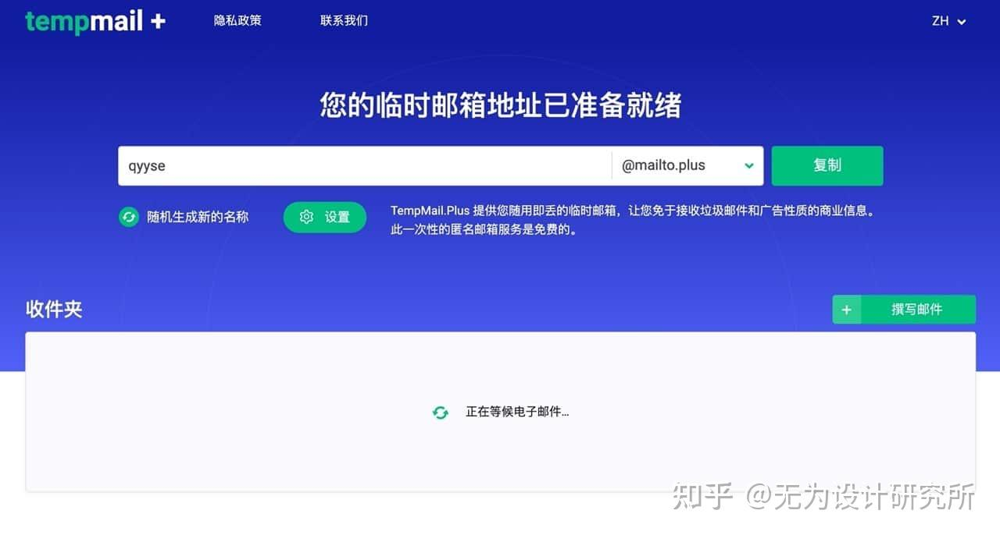
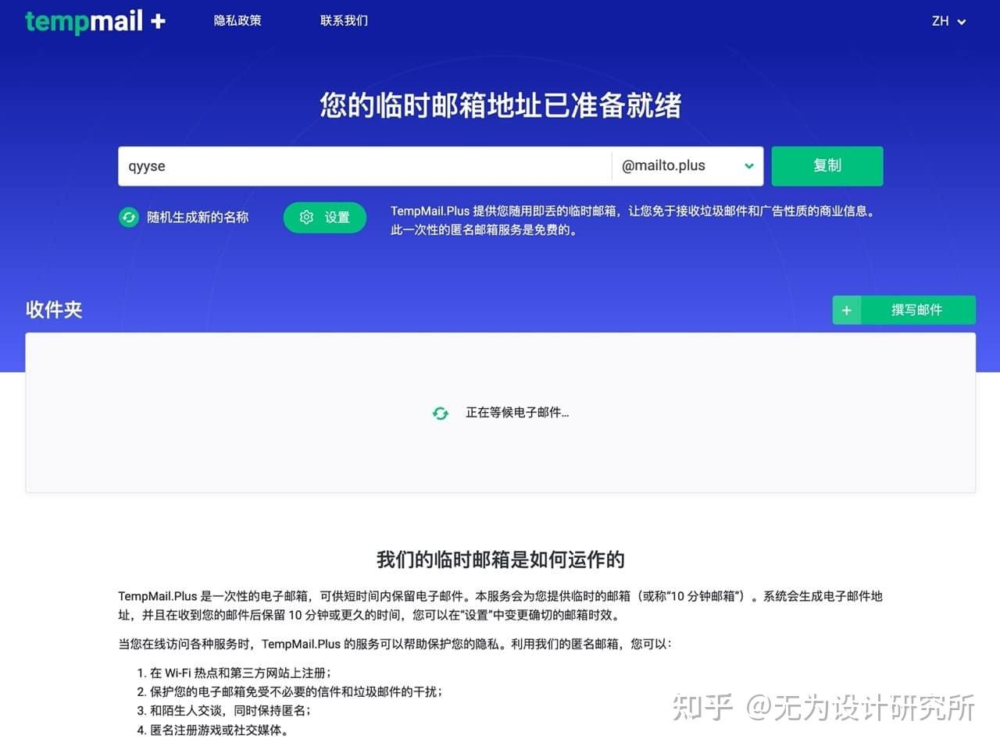
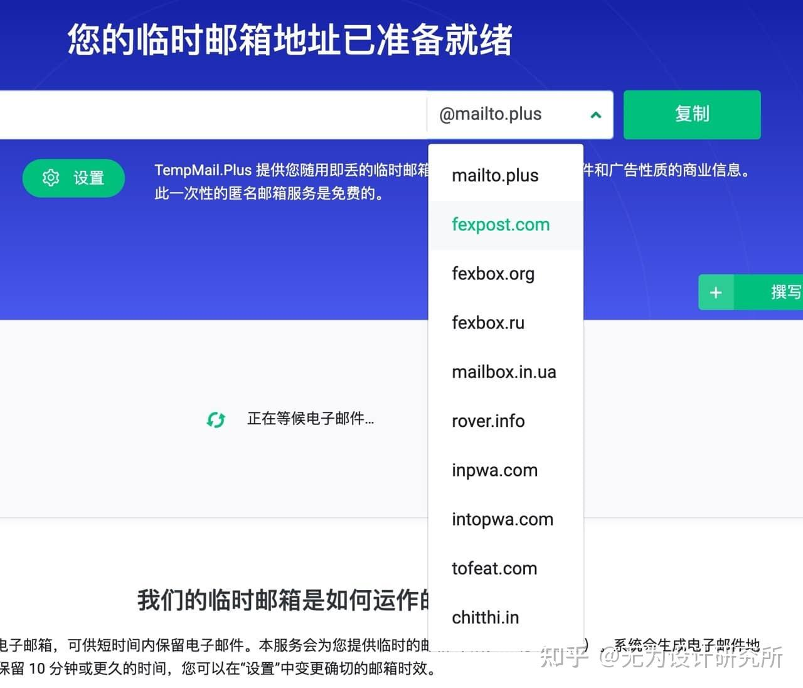
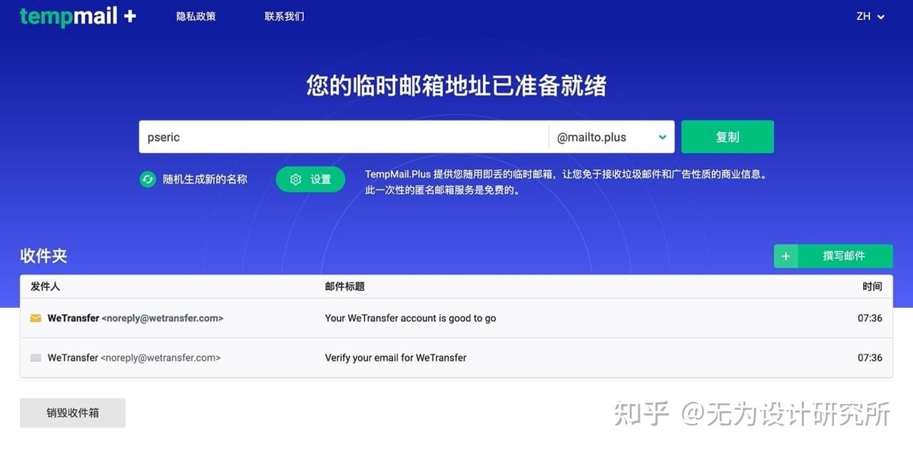
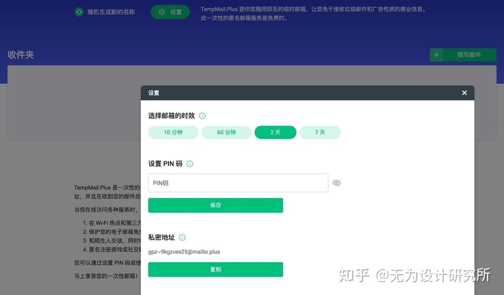
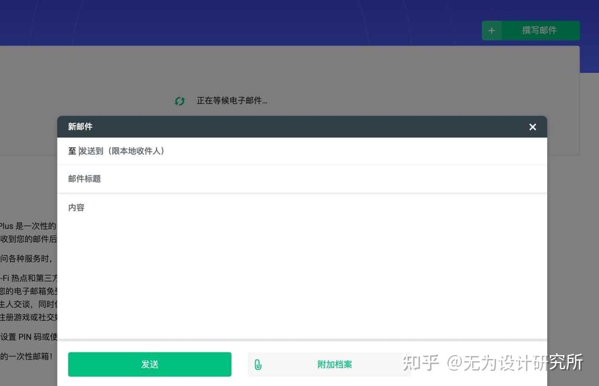

# TempMail.Plus 临时邮箱使用指南

## 简介

TempMail.Plus 是一个随用即丢的免费临时邮箱服务，提供随机生成的 Email 地址用于短期接收邮件。除了随机选择名称外，用户还可以自定义 Email 地址、设置 PIN 密码让邮箱地址可供长期使用。不过需要注意的是，如果一段时间没有使用，邮箱依然会被自动删除。

## 主要特点

- 提供 10 分钟、60 分钟、2 天、7 天不同的邮箱时效
- 支持 10 种不同的域名后缀
- 可自定义 Email 地址
- 支持设置 PIN 密码保护
- 提供邮件撰写功能
- 支持中文界面

## 使用教程

### 1. 获取临时邮箱

1. 访问 [TempMail.Plus](https://tempmail.plus/zh/)
2. 网站会自动随机生成一个临时邮箱地址
3. 点击右侧"复制"按钮获取 Email 地址

### 2. 域名选择

TempMail.Plus 提供多种域名后缀选择：
- @mailto.plus
- @fexpost.com
- @fexbox.org
- @fexbox.ru
等

如果遇到某些服务在注册时封锁临时邮箱的 Email 地址，可以选择其他域名来绕过检测。

### 3. 邮箱设置

1. 点击"设置"按钮
2. 选择临时邮箱的时效（10分钟到7天不等）
3. 设置 PIN 码（可选）
   - PIN 码可以保护特定的 Email 地址不被他人使用
   - 需要输入正确的 PIN 码才能访问设置了密码的邮箱

### 4. 私密地址功能

TempMail.Plus 提供"私密地址"功能：
- 类似于邮件别名（Alias）
- 可以避免将 TempMail.Plus 地址透露给他人
- 通过私密地址收到的邮件会自动转发到当前的临时邮箱

### 5. 发送邮件

TempMail.Plus 支持发送邮件功能：
1. 点击网站右上角的"撰写邮件"
2. 输入收件者 Email、邮件标题和内容
3. 可以附加文件
4. 适合需要匿名发送邮件的场景

## 使用建议

1. 选择合适的邮箱时效
2. 建议设置 PIN 码保护重要邮箱
3. 定期检查邮件内容
4. 使用完毕后可以点击"销毁收件匣"手动删除所有邮件

## 注意事项

- 临时邮箱有使用时效限制
- 一段时间不使用会被自动删除
- 建议在重要操作前先测试邮箱是否可用
- 不要用于接收重要或敏感信息 